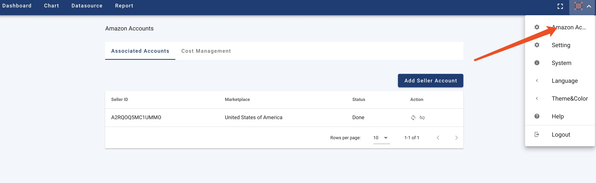

Click the menu as shown in the figure below to open the Amazon seller management page:

Click Add seller account, you will be guided to Amazon seller platform for authorization; if authorization is successful, your account will be displayed here. The first step you need to do is to add marketplace and synchronize the data.