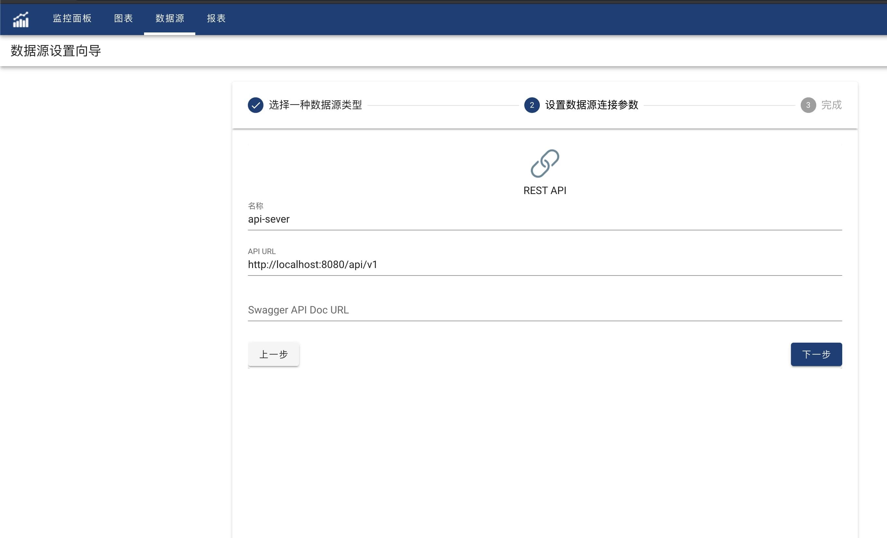

AS3AP can read data through HTTP REST-API.

#### API Server
AS3AP requests REST-API can return the following json data format：
```json
  {
    "columns":["column1","column2","..."],
    "rows":[
      ["column1-value","column2-value",""],
      ["column1-value","column2-value",""]
    ]
  }

```
AS3AP don't distingish each column data type, all column value would be string type.
AS3AP will mapping data type and format during visualization design.
If REST-API has different data format, a data adapter layer is required to convert the format.

#### Creation
In Data source list page, click '+' to create a new data source. Select 'REST-API', click 'Next'.
Input REST-API data source name, API Server URL. Swagger API Doc URL is optional.



API Server's URL looks like **http(s)://server-host:server-port**. 
If all URLs start with **api/v1**, the URL could also be **http(s)://server-ip:server-port/api/v1**
Click 'Next' to finish

#### Query
Use JSON format to query REST-API
```json
{
    "method": "",
    "url": "",
    "headers": {
    "http-header-name": "http-header-value"
    },
    "body": {
    
    }
}
```
- method
Optional, only support 'GET' and 'POST', default 'GET'
- url
Mandtory, relative path to REST-API server URL.
For example, if the server URL is http://localhost:8080/api/v1, and the query request url is http://localhost:8080/api/v1/types, then the url here should be **types**.
- headers
Optional, support to have multiple http headers, such as Content-Type, Accept-Type, etc，
- body
Optional, rest-api request body, mostly required for 'POST' method
